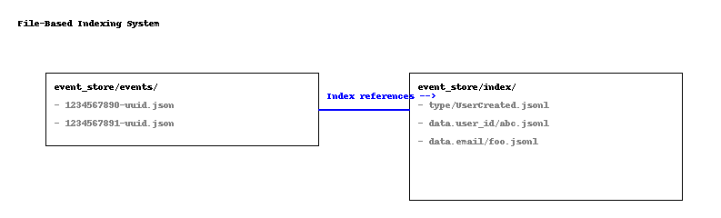

# A file-based DCB compatible Event Store

A minimal, append-only, file-based event store designed for reliability, simplicity, and full control over event integrity and ordering.

This event store supports queryable indexing, optimistic concurrency control via append conditions, and multi-process safety through file-based locking.

---

## ✨ How to Use

### ✍️ Appending / Writing Events

To write one or more events:

```ruby
stored = store.write(
  events: [MyEvent.new(data: { ... })]
)
```

### ⛔ Append Conditions (Optimistic Concurrency)

You can enforce consistency by preventing writes if conflicting events exist.

```ruby
query = Query.new([
  QueryItem.new(
    types: ["ItemAdded"],
    properties: {"cart_id" => "123"}
  )
])

store.write(
  events: [ItemAdded.new(data: {...})],
  condition: AppendCondition.new(
    fail_if_events_match: query,
    after: last_known_position
  )
)
```

* If new events matching the query have been written **after** the given position, the write fails.
* This is useful for building safe decision models or enforcing business rules like "only add if cart has fewer than 3 items."

---

## ⚙️ How It Works

### 📂 Storage of Events

Each event is:

* Stored as a JSON file in `event_store/events/<id>.json`
* The file name is composed of a timestamp and UUID for uniqueness and ordering
* A global append log (`event_store/log/append.log`) records the order of events

### ⚖️ Global Ordering (Sequence Numbers)

* Every event gets a **sequence number** derived from its position in the append log
* This enables globally ordered reads and cursor-based pagination

### 🔎 Indexing

For every key-value pair in an event's data:

* An index file is updated: `event_store/index/<property>/<value>.jsonl`
* Each file contains a list of event IDs matching that property
* Allows exact and partial (regex) queries using these indexes

Visual reference:


### 🔒 Locking

To ensure consistency in concurrent environments:

* **Query-scoped file locks** are created using a SHA256 hash of the query content
* Locks are held only during the append condition check + actual write
* Retries with exponential backoff are built-in to minimize collisions

This ensures multi-threaded and multi-process writes remain safe without long lock durations.

---

## ❓ Querying

You can read events by building expressive queries:

```ruby
query = Query.from_items([
  QueryItem.new(
    types: ["UserCreated"],
    properties: {"email" => /^foo@/}
  )
])

store.read(query: query)
```

* Each `QueryItem` acts as an OR condition
* Inside each item, `types` and `properties` are combined using AND
* You can also use `Query.all` to read the entire log

---

## ✨ DCB Compatibility

This event store is fully compatible with the [DCB Event Store Specification](https://dcb.events/specification/):

* **Sequence Position**: Events are globally ordered via `append.log`, and their sequence position is derived from their line number in this log.
* **Append Condition**: Supports `failIfEventsMatch` queries and an optional `after` position, enforcing optimistic concurrency control exactly as specified.
* **Query Items**: `QueryItem` class allows filtering by type and arbitrary properties (as DCB tags), with AND logic within items and OR across items.
* **Cursor-Based Pagination**: Through `ReadOptions` with `from` and `backwards`, enabling streaming semantics.

This design allows you to implement a DCB-compliant Event Store interface using only the filesystem, while retaining all core consistency and querying guarantees.

---

## 🧬 Referential Integrity Inspired by Git

This event store builds on a file-based indexing system that guarantees referential integrity — much like the Directed Acyclic Graph (DAG) in Git.

- Each event is stored immutably as a `.json` file, with a unique ID composed of timestamp and UUID.
- Index files (`index/<property>/<value>.jsonl`) act like Git references — each line pointing to a known event ID.
- Events are never modified, only appended — enabling full traceability.
- If an index points to an event ID, and the file exists, the reference is valid. No dangling pointers.
- This ensures strong consistency and long-term stability, even under concurrent writes or system crashes.

Much like Git enables distributed version control through immutable data and content-addressed storage, this event store embraces the same principle — ensuring all operations are append-only, verifiable, and debuggable with just the filesystem.

## ⚡ Performance Notes

* All reads and indexes are file-based
* Indexes can be preloaded or memory-mapped for performance
* Sequence lookup is optimized through the append log (no in-memory counter)

---

## 🔧 Extensibility Ideas

* Memory-mapped sequence index
* Event projections and subscribers
* File system compaction
* Bloom filters for negative cache on indexes

---

## 🔍 Why File-Based?

* Immutable, append-only design inspired by Git
* Works anywhere: no DB required
* Transparent and introspectable
* Debuggable with `cat`, `grep`, and friends

---

## 🚀 Philosophy

This project combines:

* Git's referential integrity
* Lucene-like inverted indexes
* Event-sourcing best practices

All powered by the most stable and portable backend: your filesystem.

---

## ✏️ License

MIT
